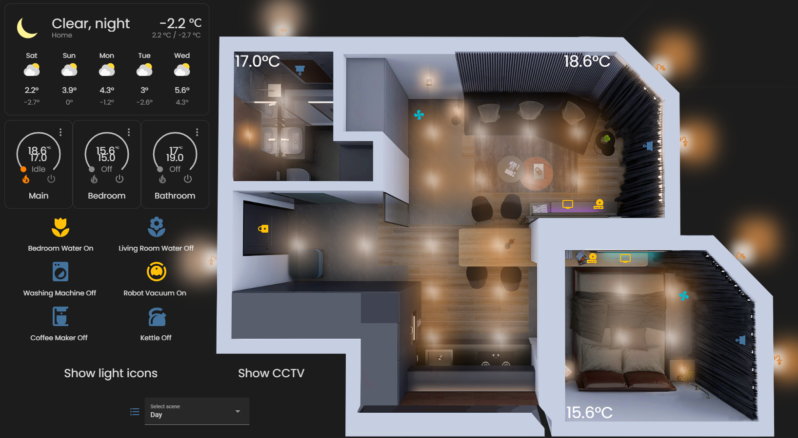
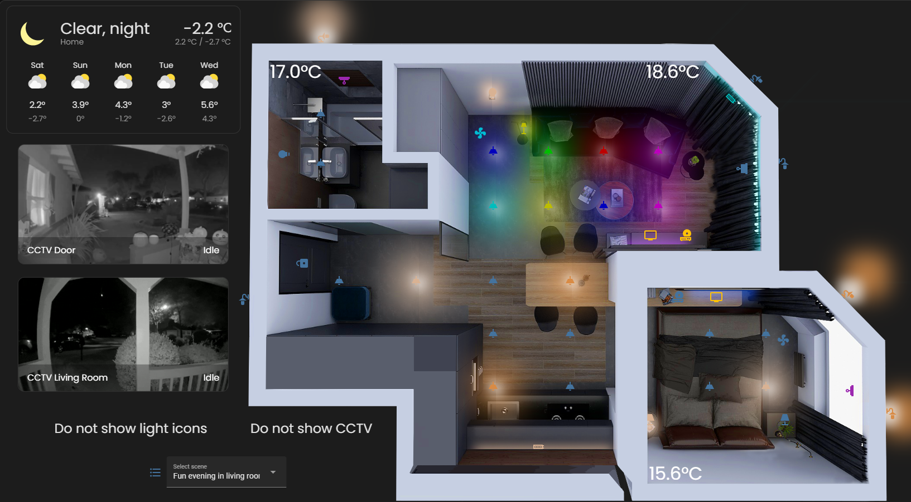

# Smart Dom

## Instrukcja na Windows:
1. Pobierz Oracle VM VirtualBox i plik vdi z https://www.home-assistant.io/installation/windows/ 
2. Wykonaj krok *HYPERVISOR SPECIFIC CONFIGURATION* z instrukcji powyżej.
3. Po uruchomieniu VM załóż konto na HA ( http://homeassistant.local:8123 )
4. Włącz Advanced Mode (ikona użytkownika po lewej -> Advanced Mode).
5. Pobierz i uruchom Add-ons (Settings -> Add-ons -> Add-on store): File editor (+ Show in sidebar) oraz Samba share (+ username i password w Configuration).
6. Pobierz z repozytorium https://github.com/iantrich/config-template-card/releases/tag/1.3.6 , https://github.com/custom-cards/decluttering-card/releases/tag/0.6.3 oraz https://github.com/thomasloven/lovelace-card-mod/releases/tag/3.2.0 pliki js.
7. Używając Samba share skopiuj pliki z folderu lovelace oraz zawartość repozytorium https://github.com/mk-maddin/dummy-HA i pliki js:
 - zgodnie z dokumentacją wejdź w *\\\192.168.1.111* (url wzięty z okna powitalnego po uruchomeniu HA System information -> IPv4) w File Explorer i zaloguj się używając danych z Configuration Samba share
 - lovelace skopiuj do *\\\192.168.1.111\config\www* (folder www należało utworzyć) 
 - folder dummy z repozytorium do *\\\192.168.1.111\config\custom_components* (folder custom_components należało utworzyć)
 - config-template-card.js, decluttering-card.js i card-mod.js do *\\\192.168.1.111\config\www*
 - zrestartuj system (Developer Tools -> Restart)
8. Przekopiuj zawartość yaml/configuration.yaml do /config/configuration.yaml w HA (File editor -> /config/configuration.yaml). Zapisz i w Developer Tools zrestartuj system.
9. Wejdź w Settings -> Add integration. Dodaj dwie instancje Generic Camera z HTTP i wyłączonym Verify SSL certificate
 - Still Image URL: https://i.chzbgr.com/full/9488342272/h94E0A0D0/plant potem rename: CCTV Door
 - Still Image URL: https://i.chzbgr.com/full/9488344064/h196B9947/infant-bed potem rename: CCTV Living Room
10. Wejdź w Settings -> Add integration. Dodaj AccuWeather z ApiKey (wystarczy free konto na https://developer.accuweather.com/ )
11. Utwórz nowy dashboard (Settings -> Dashboards -> Add dashboard). Otwórz utworzony dashboard, kliknij trzy kropki u góry z prawej strony i wybierz Edit Dashboard, potem Start with an empty dashboard i Take control.
12. W nowym dashboardzie kliknij trzy kropki u góry z prawej strony i wybierz Edit Dashboard. Ponownie kliknij w krzy kropki u góry z prawej strony i Raw configuration editor. Do środka konfiguracji wklej zawartość pliku yaml/dashboard_configuration.yaml i zapisz.
13. Preferowany dark mode :) (ikona użytkownika po lewej -> Theme -> Dark)

